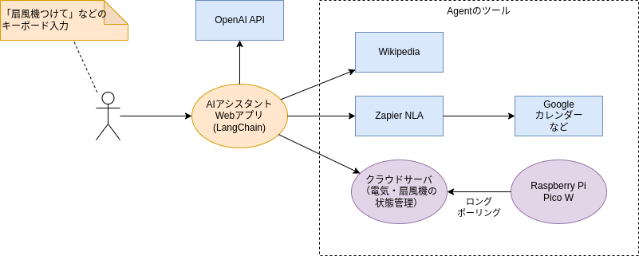

# langchain-ai-assistant-hands-on

【書籍出版記念 vol2】LangChain で AI アシスタントを動かすハンズオン【オフライン開催】

イベントページ: https://studyco.connpass.com/event/298456/

## 概要構成図

## 前提

Google Colab を使用するため、Google アカウントが必要です。

## ハンズオンの進め方

### 準備

[colab.ipynb](./colab.ipynb) をダウンロードして、Google Drive の適当なフォルダにアップロードしてください。

### Step0: Streamlit で Chat Completions API を呼び出してみよう

1. Google Colab で `colab.ipynb` を開いて、`simple_app.py` の実行まで進めてください。
2. 適当に会話をしてみましょう。

※ OpenAI の API キーは、アカウント登録したうえで [こちら](https://platform.openai.com/account/api-keys) から発行してください。

### Step1: AI エージェントを動かしてみよう

1. `simple_app.py` を停止して、`agent_app.py` を実行してください。
2. 適当に会話をしてみましょう。

### Step2: エージェントが Wikipedia を検索できるようにしてみよう

1. `agent_app.py` を編集して、エージェントが Wikipedia の検索をできるようにしてください。
2. gpt-3.5-turbo が知らないはずのことを聞いてみましょう。（例「Stable Diffusion とは」）

### Step3: Zapier NLA で Google カレンダーに予定を登録させてみよう

> **Warning**
> このステップを進めるためには、Zapier に Google カレンダーの権限を付与する必要があります。
> 使用する Google アカウントに注意してください。
> もし Zapier に Google カレンダーの権限を付与したくない場合は、このステップはスキップするか、他のサービスとの連携を試してみてください。

1. [こちらのページ](https://nla.zapier.com/credentials/) の「API Key」の手順に従って、Zapier NLA の API キーを発行してください。

Zapier NLA から Google カレンダーへの登録を実施するには、以下のような設定になります。

| 設定項目                                 | 設定値                                                                                 |
| ---------------------------------------- | -------------------------------------------------------------------------------------- |
| Action                                   | Google Calendar: Quick Add Event                                                       |
| Google Claendar Account                  | Zapier NLA に操作させるアカウント                                                      |
| Calendar                                 | Zapier NLA に操作させるカレンダー (通常、メールアドレスを選択します)                   |
| Describe Event                           | Have AI guess a value for this field                                                   |
| Attendees                                | Do not include a value for this field                                                  |
| Action Name                              | google-calendar-add-event                                                              |
| Require preview before running AI Action | **チェックを外す** (チェックを外さないと、Zapier 上でアクションの承認が必要になります) |

2. `agent_app.py` を編集して、エージェントが Zapier NLA を使えるようにしてください。
3. Google カレンダーへの登録を依頼してみましょう。（例「明日の 13 時に会議の予定を登録して」）

### Step4: Streamlit 上の部屋の電気・扇風機（の画像）を操作させよう

1. `agent_app.py` を編集して、エージェントが Streamlit 上の部屋の電気・扇風機（の画像）を操作できるようにしてください。
2. 電気・扇風機を操作させてみましょう。（例「電気つけて」「扇風機つけて」）

### Step5: ネットワークの向こうの電気・扇風機を操作させよう

1. `agent_app.py` を編集して、エージェントがネットワークの向こうの電気を操作できるようにしてください。
2. 電気・扇風機を操作させてみましょう。（例「電気つけて」「扇風機つけて」）

※ ツールに設定する `server_host` と `room_id` は講師に確認してください。
