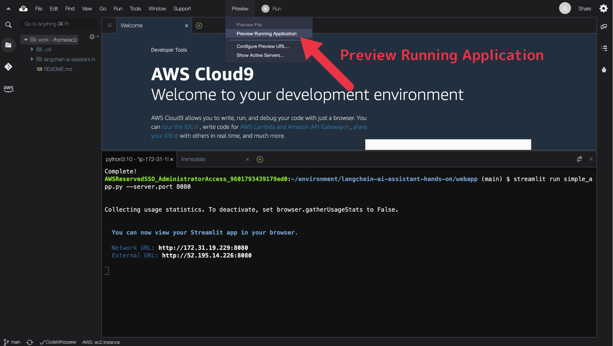
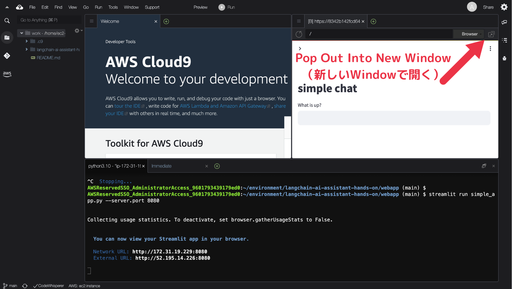

# Cloud9 を使用する場合の構築手順

何らかの原因で、Google Colab で全員がうまくハンズオンできないこともあるかもしれません。

そのような場合に備えた、AWS Cloud9 を使った環境構築手順です。

## 構築手順

### 1. Cloud9 の環境を作成

| 設定項目           | 設定値                  |
| ------------------ | ----------------------- |
| 環境タイプ         | 新しい EC2 インスタンス |
| インスタンスタイプ | t2.micro                |
| プラットフォーム   | Amazon Linux 2          |

### 2. pyenv のインストール

> **Note**
> 以後のコマンドは Cloud9 のターミナルで実行してください。

```console
curl https://pyenv.run | bash
echo 'export PYENV_ROOT="$HOME/.pyenv"' >> ~/.bashrc
echo 'command -v pyenv >/dev/null || export PATH="$PYENV_ROOT/bin:$PATH"' >> ~/.bashrc
echo 'eval "$(pyenv init -)"' >> ~/.bashrc
exec "$SHELL"
pyenv --version
```

### 3. Python 3.10 のインストール

```console
sudo yum remove -y openssl-devel
sudo yum install -y openssl11-devel bzip2-devel xz-devel
pyenv install 3.10
pyenv global 3.10
python --version
```

> **Note**
> 上記の中で `pyenv instal 3.10` コマンドの実行には数分ほど時間がかかります。

### 4. ソースコードの準備

```console
git clone https://github.com/os1ma/langchain-ai-assistant-hands-on.git
cd langchain-ai-assistant-hands-on/webapp
```

### 5. パッケージのインストール

```console
pip install --quiet streamlit==1.27.1 langchain==0.0.306 openai==0.28.1 wikipedia==1.4.0
```

### 6. Streamlit の Web アプリを起動

```console
streamlit run simple_app.py --server.port 8080
```

または

```console
streamlit run agent_app.py --server.port 8080
```

### 7. Cloud9 のプレビュー機能でアクセス




