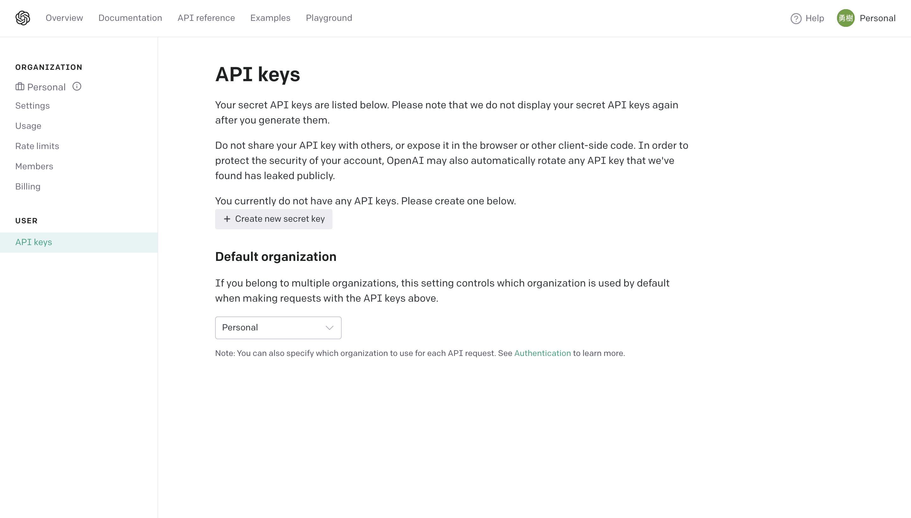
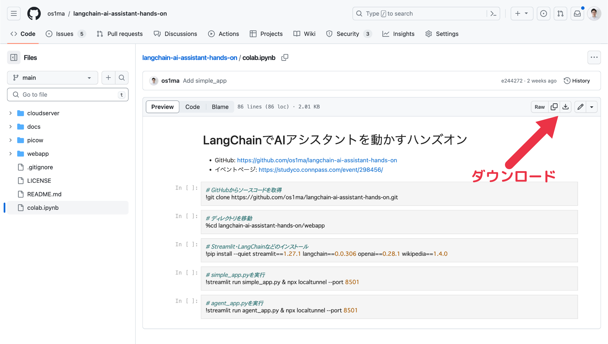
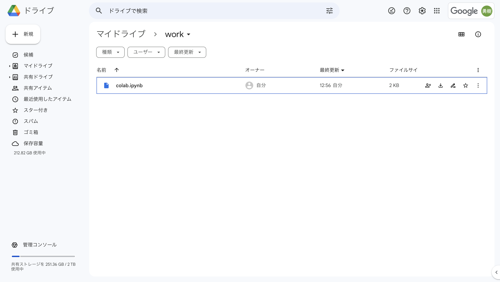
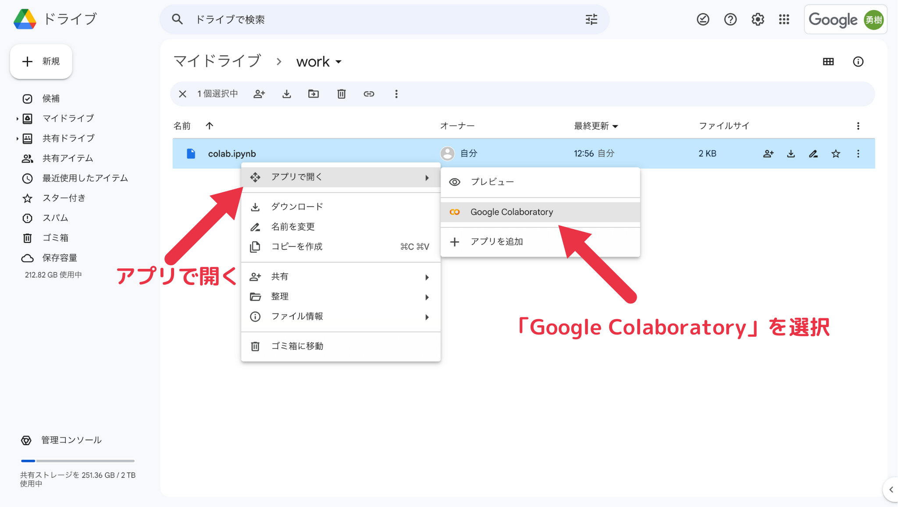
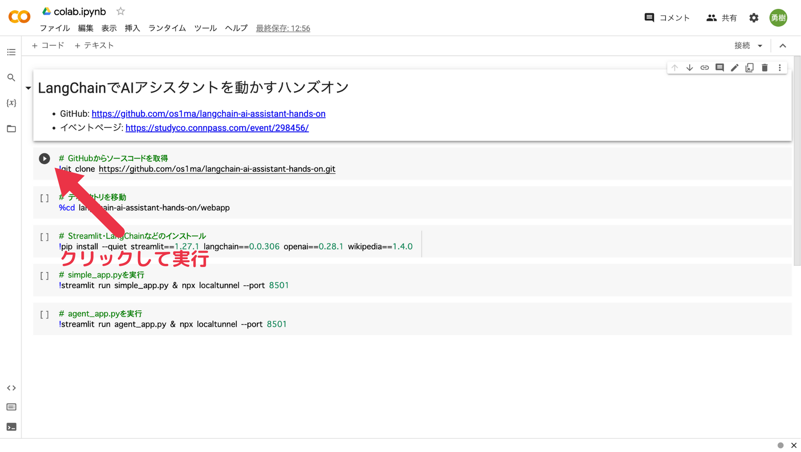
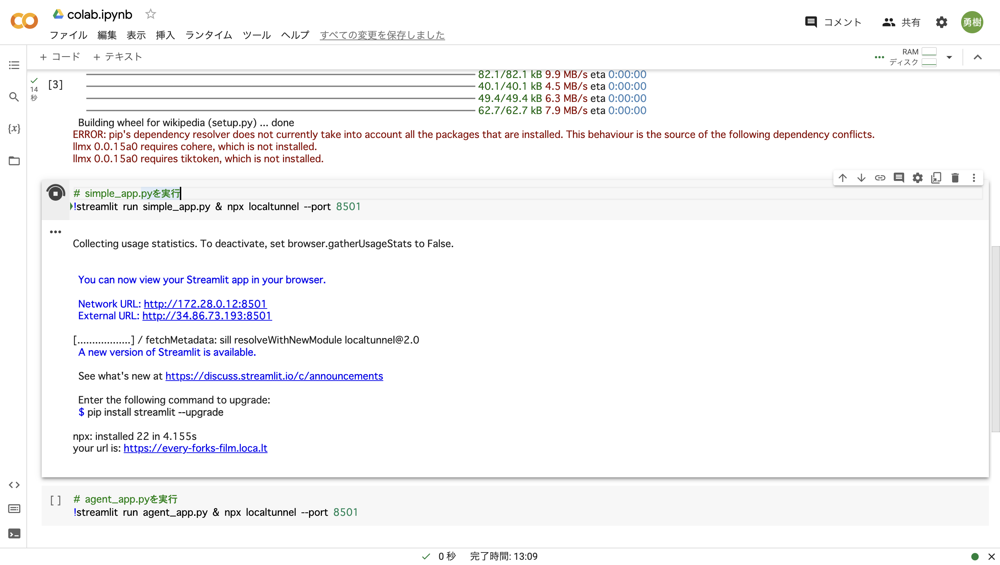
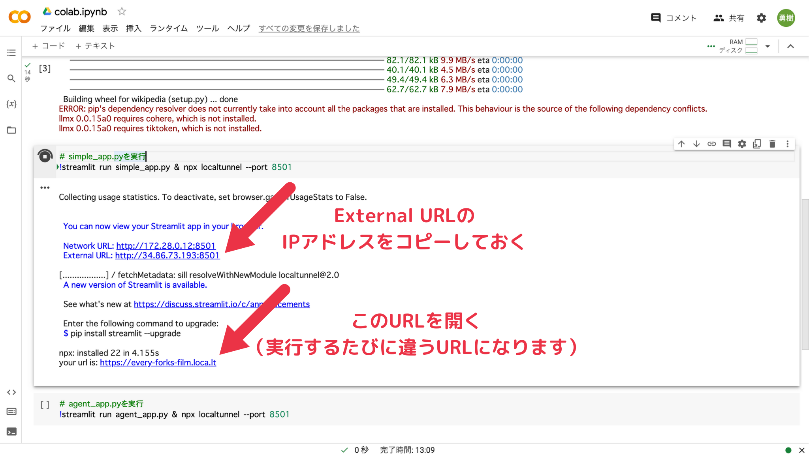
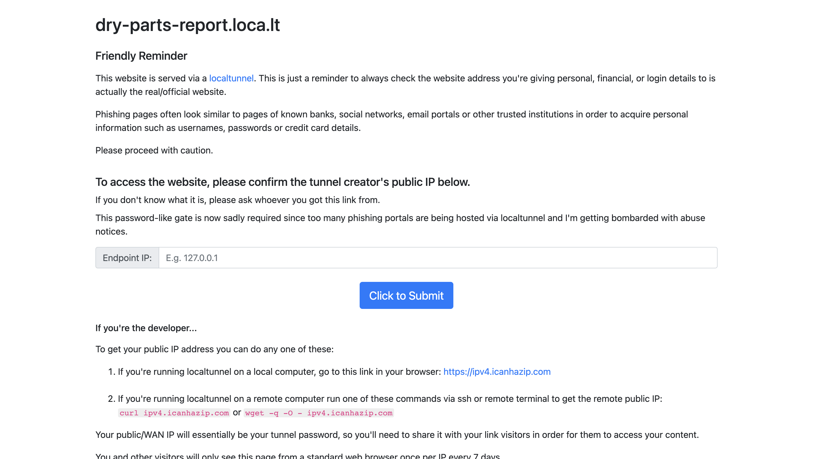
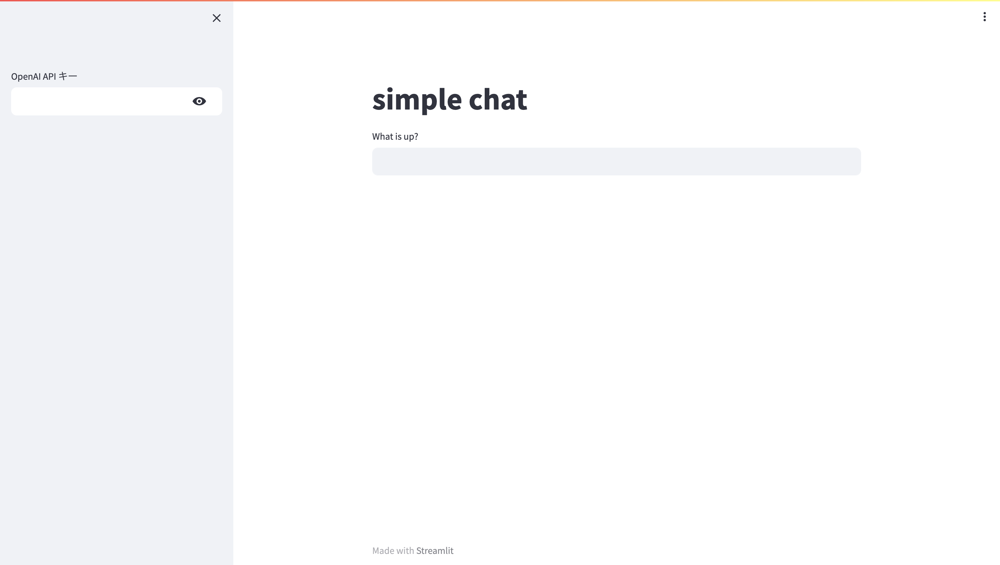
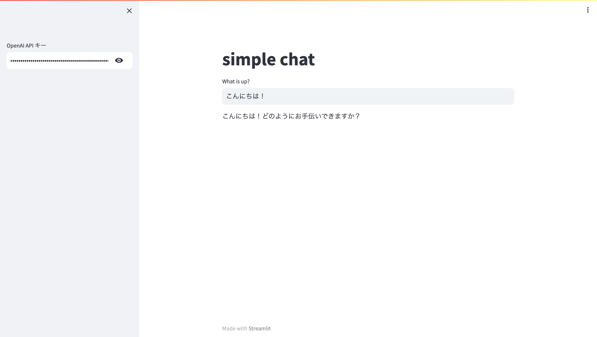

# Step1: Streamlit で Chat Completions API を呼び出してみよう

## ハンズオン手順

### 1. OpenAI にアカウント登録して、API キーを発行してください。

OpenAI の API キー発行画面: https://platform.openai.com/account/api-keys



発行した API キーは何度かコピーアンドペーストすることになります。
ハンズオンの間、API キーをコピーしやすいようにしておいてください。

#### OpenAI の API のプランについて

OpenAI の API キーを使うには、初めてアカウント登録したあとしばらくだけ有効な無料トライアルを使うか、有料プランに登録する必要があります。
（有料プランの場合、このハンズオンを進める範囲でも多少の料金が発生します）

OpenAI の API の有料プランは、以前登録した方は、使った分だけ月々請求される形式でした。

しかし最近新しくアカウントを作成した場合は、API 使用量を事前に購入する前払い形式になっています。
前払い形式の場合、このハンズオンを進める範囲であれば、最低金額の 5 ドルで十分足ります。

参考: https://help.openai.com/en/articles/8264644-what-is-prepaid-billing

### 2. [colab.ipynb](../colab.ipynb) をダウンロードしてください。



### 3. ダウンロードした `colab.ipynb` を、Google Drive の適当なフォルダにアップロードしてください。



### 4. Google Colab で `colab.ipynb` を開いてください。



> **Note**
> 「Google Colaboratory」が表示されない場合は、「アプリを追加」から「Google Colaboratory」を検索して追加してください。

### 5. `simple_app.py` の実行まで進めてください。



次の画像のように表示されるまで実行を進めてください。



### 6. 表示された URL にアクセスして、「External URL」の IP アドレスを入力してください。



以下の画面では、Google Colab 上で「External URL」として表示された「http://<IP アドレス>:8501」のうち、IP アドレスの部分だけを入力してください。



> **Note**
> localtunnel というツールを使い、Google Colab で起動した Streamlit の Web アプリにアクセスできるようにしています。
> localtunnel で公開した Web アプリには、URL さえ分かれば誰でもアクセスできます。

### 7. 適当に会話してみましょう。



OpenAI の API キーを貼り付けたうえで、例えば「こんにちは！」などと入力してください。
LLM (GPT-3.5) が生成した文章が表示されることを確認してください。



> **Note**
> localtunnel で公開した Web アプリには誰でもアクセスできます。
> そのため、環境変数などに OpenAI の API キーを設定していると、自分の API キーで他人がこのアプリケーションを使えてしまいます。
> そのような事態を避けるため、画面上で API キーを入力し、その API キーは入力した人のセッションのみで使われるようにしています。

## 想定されるエラーについて

### RateLimitError

OpenAI の API を実行した際に、以下のエラーが発生する場合があります。

```
openai.error.RateLimitError: You exceeded your current quota, please check your plan and billing details.
```

この RateLimitError は、OpenAI の有料プランで使用可能な量を超えたか、無料トライアルが終わっているのに有料プランに登録していない場合の表示になります。

多くの場合、無料トライアルが終わっているのに有料プランに登録していないという状況だと思われます。
そのため、有料プランに登録すれば使えるはずです。
（ただしその場合料金が発生します）

> **Note**
> 無料トライアルは、初めてサインアップしてからしばらくだけ使えるため、気が付かないうちに終了しているということが少なくありません。
