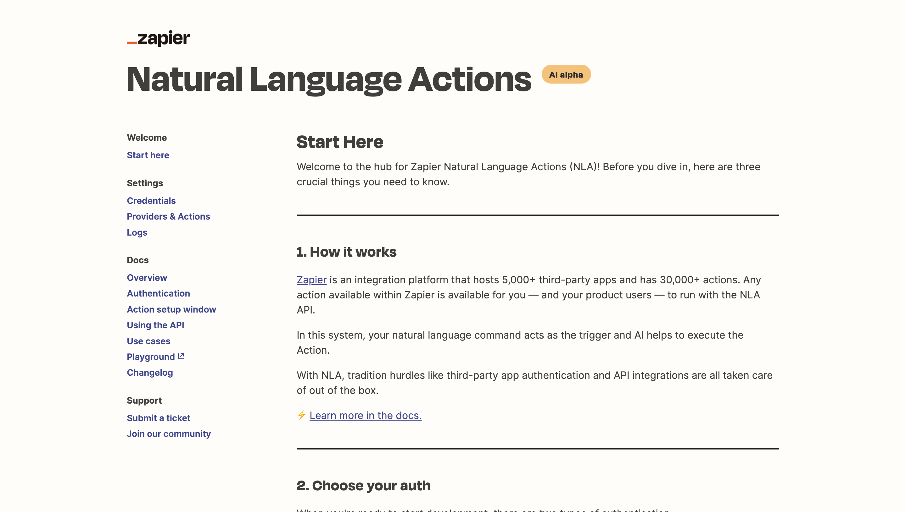
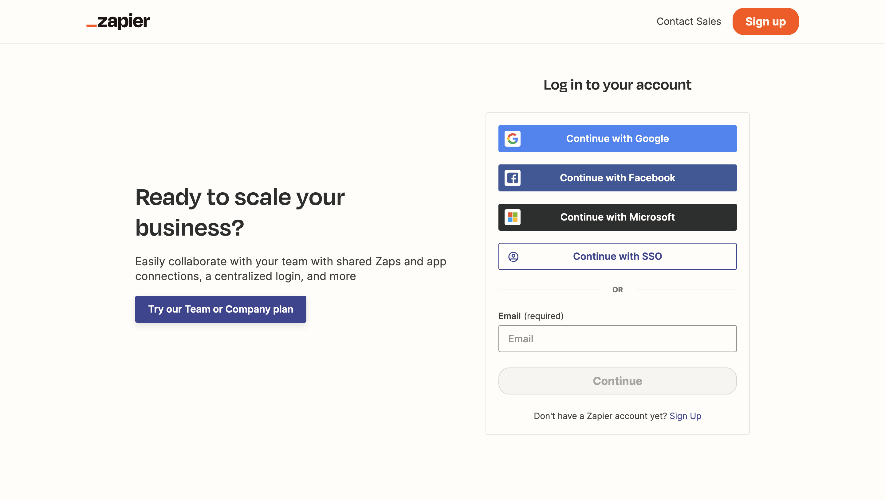
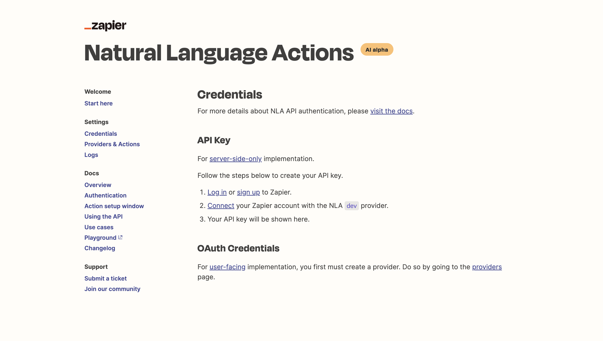
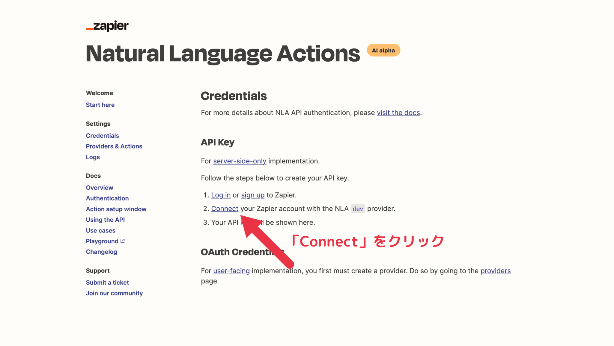
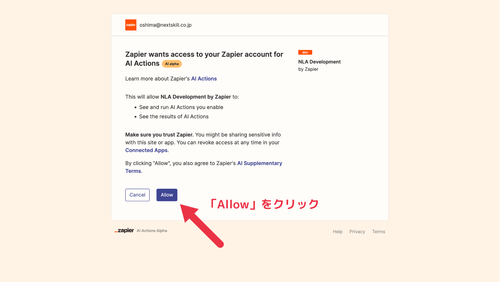
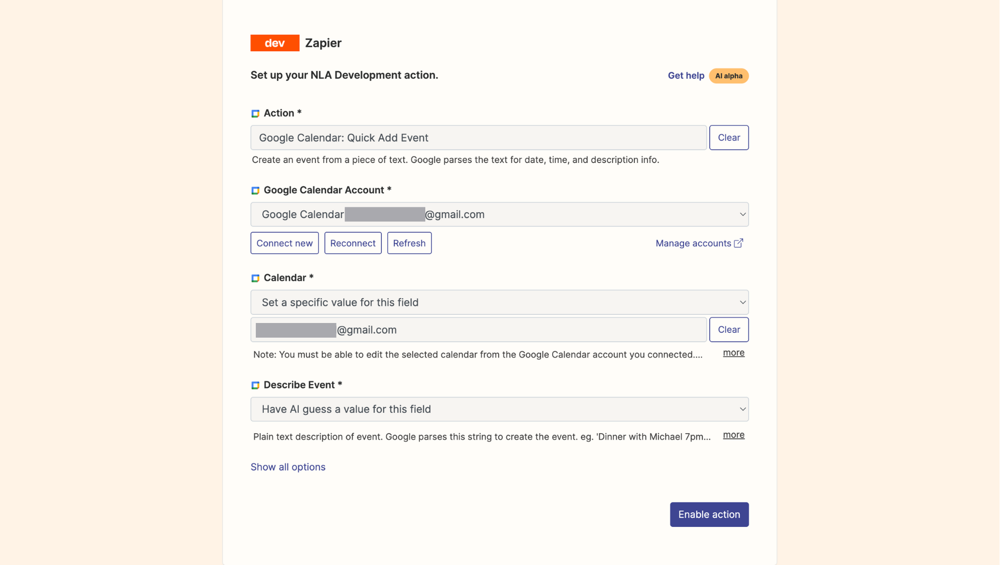
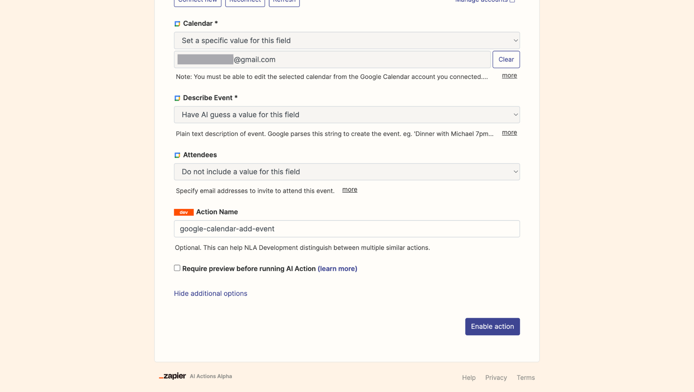
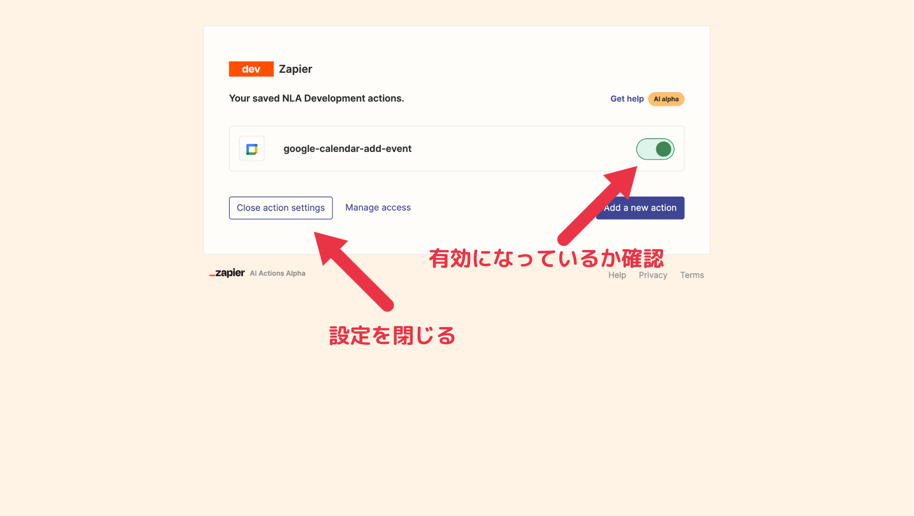

# Step3: Zapier NLA で Google カレンダーに予定を登録させてみよう

## 注意

このステップを進めるためには、Zapier に Google カレンダーの権限を付与する必要があります。
使用する Google アカウントに注意してください。

> **Warning**
> もし Zapier に Google カレンダーの権限を付与したくない場合は、このステップはスキップするか、他のサービスとの連携を試してみてください。

> **Warning**
> このステップは手順が少しややこしく、うまく動かすことができない方もいらっしゃるかもしれません。
> もしこのステップがうまくいかなかった場合でも、次のステップには問題なく取り組むことができます。

## ハンズオン手順

### 1. [Zapier NLA のページ](https://nla.zapier.com/start/) にアクセスします。



### 2. 左側のメニューの「Credentials」をクリックし、画面の指示に従って、Zapier への登録を進めてください。



> **Warning**
> Zapier への登録完了後、「アクション」の設定が始まるかもしれませんが、その設定はスキップしてください。

### 3. Zapier へのログイン後、改めて、Zapier NLA の「Credentials」画面にアクセスします。

アクセスする URL: https://nla.zapier.com/credentials/



Zapier NLA は API キーと OAuth に対応しています。
このハンズオンでは、API キーを使用します。

### 4. 「Connect」をクリックして Zapier と Zapier NLA を接続します。





### 5. Zapier NLA のアクションの設定を実施します。

Zapier NLA に「Google カレンダーに予定を登録する」というアクションを設定します。



| 設定項目                | 設定値                                                               |
| ----------------------- | -------------------------------------------------------------------- |
| Action                  | Google Calendar: Quick Add Event                                     |
| Google Claendar Account | Zapier NLA に操作させるアカウント                                    |
| Calendar                | Zapier NLA に操作させるカレンダー (通常、メールアドレスを選択します) |
| Describe Event          | Have AI guess a value for this field                                 |

「Show all options」をクリックして、さらに設定を追加します。



| 設定項目                                 | 設定値                                                                            |
| ---------------------------------------- | --------------------------------------------------------------------------------- |
| Attendees                                | Do not include a value for this field                                             |
| Action Name                              | google-calendar-add-event (何でもいいですが、AI が理解しやすい名前をつけましょう) |
| Require preview before running AI Action | **チェックを外す**                                                                |

この内容で「Enable action」として、アクションを有効化してください。

> **Warning**
> 「Require preview before running AI Action」のチェックを外すのを忘れないように注意してください。
> チェックを外さないと、AI アシスタントが「Google カレンダーに予定を登録しよう」としたときに、Zapier 上でアクションの承認が必要になります

### 6. アクションが有効になったことを確認します。



> **Note**
> このアクション一覧画面には「Providers & Actions」画面の「Manage Actions」から遷移できます。
> 設定を見直したい場合は「Providers & Actions」画面から遷移してください。

### 7. `agent_app.py` を編集して、エージェントが Zapier NLA を使えるようにしてください。

以下の箇所を...

```python
    # Step3: Zapier NLA で Google カレンダーに予定を登録させてみよう（明日の13時に会議の予定を登録して）
    # zapier_tools = load_zapier_tools_for_openai_functions_agent()
    # tools.extend(zapier_tools)
```

次のようにしてください。

```python
    # Step3: Zapier NLA で Google カレンダーに予定を登録させてみよう（明日の13時に会議の予定を登録して）
    zapier_tools = load_zapier_tools_for_openai_functions_agent()
    tools.extend(zapier_tools)
```

> **Warning**
> agent_app.py の編集後、ファイルの保存を忘れないように注意してください。

### 8. Google カレンダーへの登録を依頼してみましょう。

例えば「明日の 13 時に会議の予定を登録して」と依頼してみてください。
