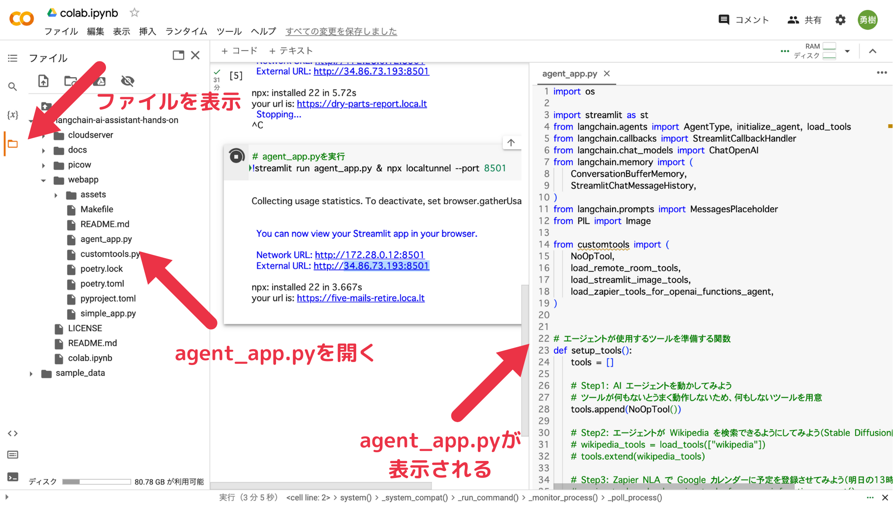
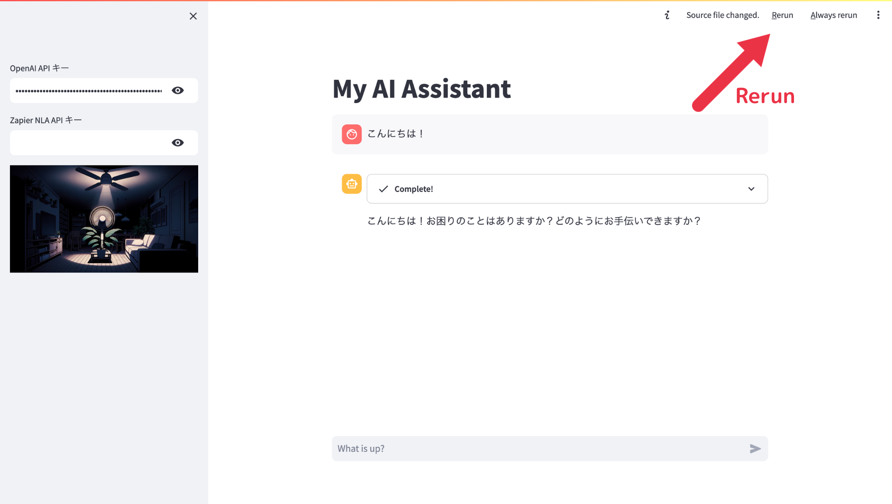

# Step3: エージェントが Wikipedia を検索できるようにしてみよう

## ハンズオン手順

### 1. Google Colab で `agent_app.py` を開きます。

`langchain-ai-assisstant-hands-on/webapp` ディレクトリにある `agent_app.py` を開いてください。



### 2. `agent_app.py` を編集して、エージェントが Wikipedia を検索できるようにしてください。

以下の箇所を...

```python
    # Step3: エージェントが Wikipedia を検索できるようにしてみよう（Stable Diffusionについて教えて）
    # wikipedia_tools = load_tools(["wikipedia"])
    # tools.extend(wikipedia_tools)
```

次のようにしてください。

```python
    # Step3: エージェントが Wikipedia を検索できるようにしてみよう（Stable Diffusionについて教えて）
    wikipedia_tools = load_tools(["wikipedia"])
    tools.extend(wikipedia_tools)
```

> **Warning**
> agent_app.py の編集後、ファイルの保存を忘れないように注意してください。

> **Warning**
> Python のプログラムはインデント（左側のスペースの数）が違うと動作しません。
> コードの左のインデントが半角スペース 4 つになるよう注意してください。

### 3. Web アプリを読み込み直してください。

Streamlit の画面右上に表示される「Rerun」をクリックするか、ブラウザのリロードを実施してください。



> **Note**
> agent_app.py を編集したあと、Colab 上でコマンドを実行し直す必要はありません。

> **Warning**
> ブラウザのリロードのほうが確実な動作になります。
> 以後、「Rerun」でコードの変更がうまく反映されない場合は、ブラウザのリロードを試してみてください。

### 4. gpt-3.5-turbo が知らないはずのことを聞いてみましょう。

例えば「Stable Diffusion とは？」と聞いてみてください。

> **Warning**
> Wikipedia の API には、アクセストークンがない場合、同一 IP アドレスからのアクセスに対して 1 時間あたり 500 回までというレートリミットがあります。
> 大勢が同じ WiFi を使うといった環境では、このレートリミットに引っかからないよう、Wikipedia API の呼び出し回数に注意してください。
>
> 参考: https://api.wikimedia.org/wiki/Rate_limits

## 想定されるエラーについて

### ConnectionError

Wikipedia への接続がうまくいかず、ConnectionError などが発生する場合があるかもしれません。

その際は代替として、「terminal」というシェルでコマンドを実行するツールを試してみてください。

```python
    # wikipedia_tools = load_tools(["wikipedia"])
    # tools.extend(wikipedia_tools)
    terminal_tools = load_tools(["terminal"])
    tools.extend(terminal_tools)
```

エージェントには以下のような入力を与えてみてください。

- 「ファイルの一覧を表示して」
- 「hello.txt というファイルを作成して」
- 「hello.txt に自己紹介を書き込んで」

> **Warning**
> エージェントに「terminal」というツールを与えると、指示次第で `agent_app.py` などを削除される可能性があります。
> `agent_app.py` などの削除を依頼しないように注意してください。
